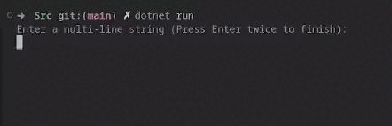
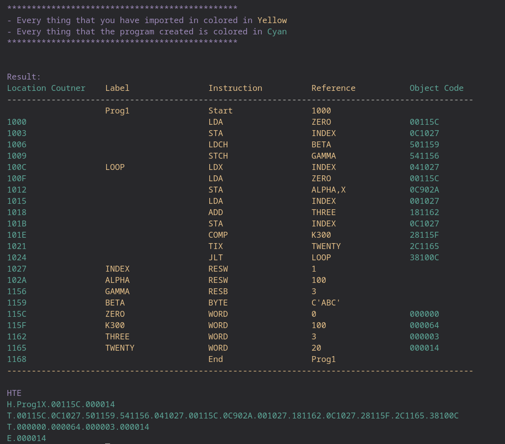

# SIC Object-Code Generator 

<b>Table of Contents</b>

-   [What is this?](#descrption)
-   [Good to Know](#good-to-know)
-   [How to use](#how-to-use)
    -   [Installation](#installation)
    -   [Input](#input)
    -   [Output](#output)

## Descrption
Object code genertor (component of compiler) which is tailored for SIC computer architecture and that is built to take SIC code form the uster and outputs the formated form of it to demonistrate how this (the object code generator) works under the hood with the compiler. 

## Good to know

 
<b>General Idea</b>

  
What is SIC Architecture?

Simplified Instructional Computer (SIC) is a hypothetical computer that has hardware features that are often found in real machines. There are two versions of this machine: 

<ol>
<li>SIC standard Model</li>
<li>SIC/XE(extra equipment or expensive)</li>
</ol>
The Simplified Instructional Computer (SIC) architecture was primarily designed for educational purposes and is not used in contemporary mainstream computer systems. Today's computers generally employ more advanced and complex architectures, such as the x86 architecture for many personal computers (including those running Windows and Linux) and ARM architecture commonly found in mobile devices. These architectures are designed to meet the demands of modern computing, including multitasking, advanced graphics processing, and diverse application requirements.

 
<b>How it Works</b>

  
Pass One

  "pass one" typically refers to the first pass of a two-pass assembler. An assembler is a program that translates assembly language code into machine code or an intermediate code. The two-pass assembly process is a common approach used to handle forward references in assembly language programs.

Here's a brief overview of the two-pass assembly process:
  <ol>
  <li>
    Symbol Table Creation: The assembler scans the entire source code to identify and record the symbols (labels, variables, etc.) used in the program. It assigns addresses to each symbol and records information about the length of instructions and data areas.
</li>

<li>
Generate Intermediate Code: As the assembler reads the source code, it generates an intermediate code that represents the operations and addresses specified in the program.
</li>
</ol>

  
Pass Two

Generate Machine Code: Using the information gathered in the first pass, the assembler generates the actual machine code instructions for the program.
Resolve Addresses: Addresses and references to symbols that were assigned during the first pass are resolved, and the final machine code is produced.

 
<b>Main Elements</b>

  
Operation Code

is a code that specifies the operation to be performed by the computer's central processing unit (CPU). It is part of the machine language instruction format. The opcode indicates the specific operation or instruction that the CPU should execute, such as an arithmetic operation, data movement, or control flow operation.
 
<b>Example:</b> is a code that specifies the operation to be performed by the computer's central processing unit (CPU). It is part of the machine language instruction format. The opcode indicates the specific operation or instruction that the CPU should execute, such as an arithmetic operation, data movement, or control flow operation.

  
Object Code

The object code consists of a sequence of binary instructions that represent the operations specified in the original program. Each instruction corresponds to a specific operation code (opcode) and may include operand addresses or other necessary information. The object code is typically in a format that the computer's central processing unit (CPU) can directly execute.

  
Operation Code vs Object Code

  Operation code is the source code for collection of instructions written using a programming language, while the object code is an output of the source code after going through a compiler.

  
Location Counter

 The location counter is a program counter specifically used by the assembler to keep track of the memory addresses assigned to the instructions and data in the program.

Here's how the location counter works in the context of SIC:

<ol>
<li>
Initialization: The location counter is initialized to the starting address of the program.

</li>
<li>
Incrementing: As the assembler processes each instruction or data statement in the assembly language program, the location counter is incremented to the next memory address.
</li>
<li>
Assignment of Addresses: The assembler uses the location counter to assign memory addresses to labels, instructions, and data. For example, when a label is encountered, the assembler assigns the current value of the location counter to that label, associating it with a specific memory address.

</li>
<li>
Forward References: The location counter is crucial for handling forward references. It allows the assembler to allocate addresses to labels even if they are defined later in the program. During the first pass of a two-pass assembly process, the location counter is used to gather information about the symbols and their addresses.
</li>
<li>
Final Addresses: By the end of the assembly process, the location counter reflects the final memory address where the program will be loaded into memory for execution.
</li>
</ol>

[Back To The Top](#sic-object-code-generator)

## How to use
### Installation
- Install [Dotnet](https://dotnet.microsoft.com/en-us/download)
 on you machine.
- Clone the repository using this command `https://github.com/Mohamed-Aymn/SIC-Object-Code-Generator.git`.
- Retrive used Nuget packages by typing `Dotnet restore` in your project root folder.
- Navigate to SRC directory by typeing `cd ./Src`, then run `dotnet run` and have fun!

[Back To The Top](#sic-object-code-generator)
### Input
You can type your SIC machine code line by line and when you finish entring code just press enter twice.

[Back To The Top](#sic-object-code-generator)

### Output 

[Back To The Top](#sic-object-code-generator)